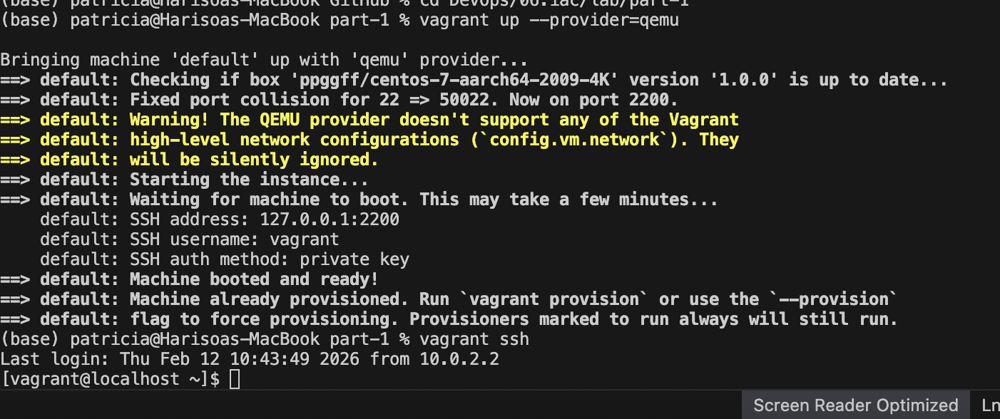
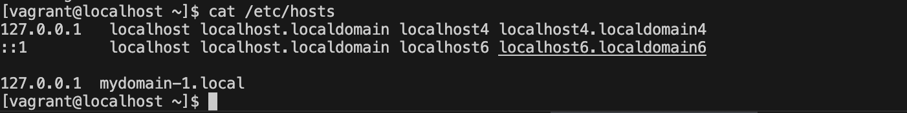
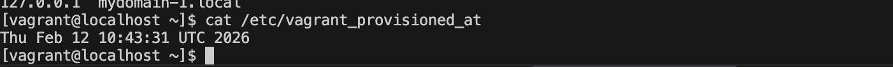
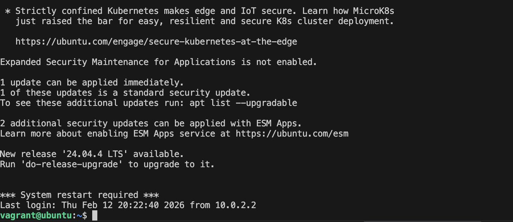
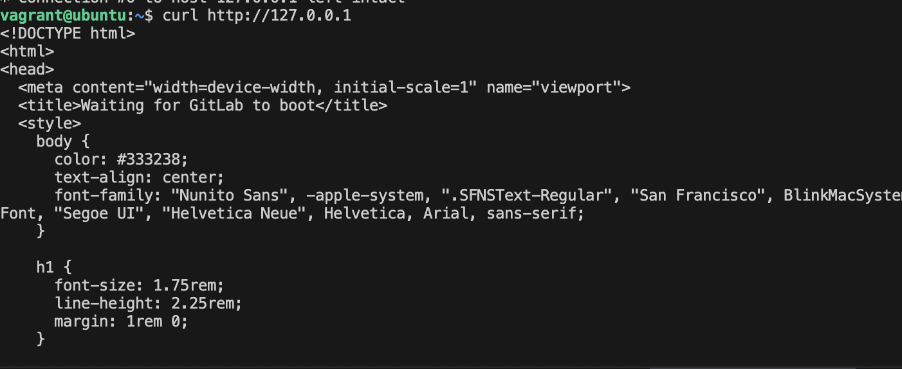
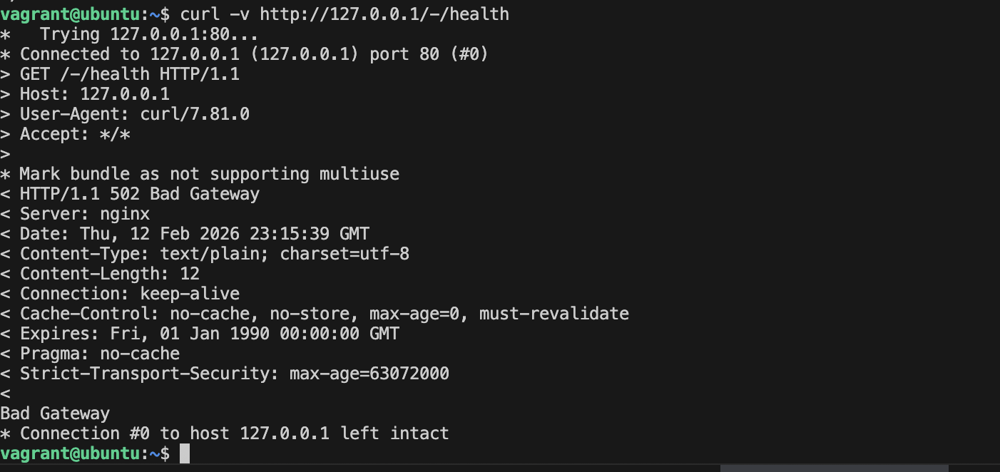
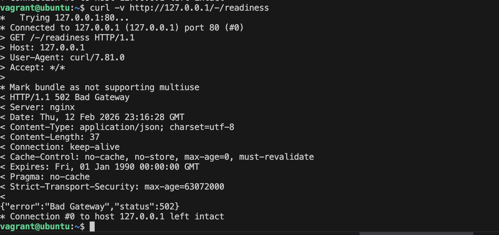
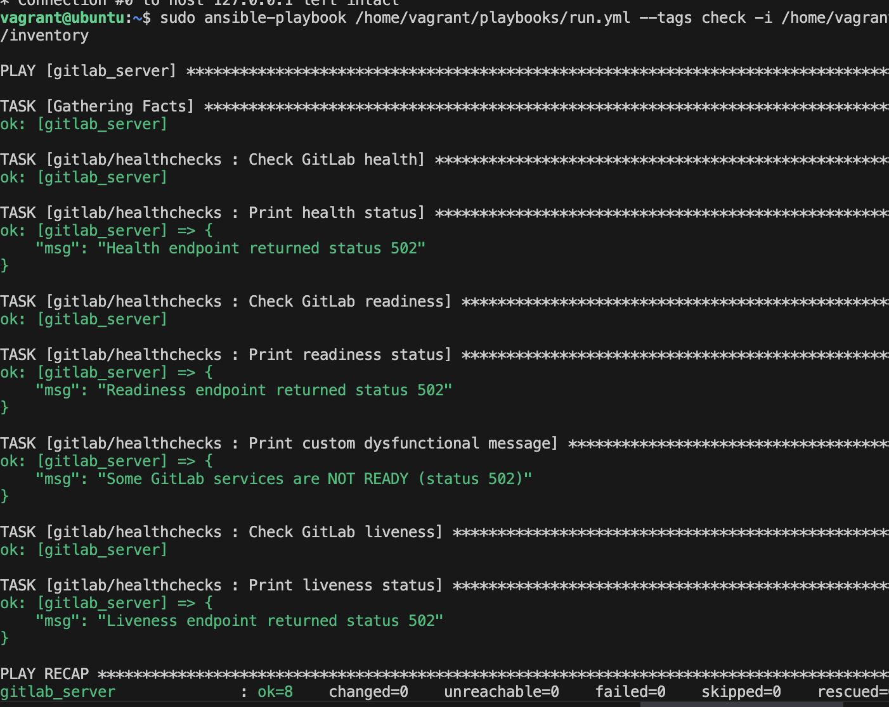

# Compte-rendu lab 6 : Infrastructure as Code (IaC) avec Vagrant et Ansible

**Date :** 12 février 2026  
**Étudiants :** Harisoa, Jennifer  
**Sujet :** IaC (Infrastructure as Code) by provisioning virtual machines using **imperative** and **declarative** approaches  
**Environnement utilisé :** VirtualBox, Vagrant, Ansible  
**Distributions :**
- Partie 1 : CentOS 7
- Partie 2 : Rocky Linux 8 (GitLab)

---

## 1. Objectif du lab

### Objectifs

Maîtriser les concepts fondamentaux de l'Infrastructure as Code (IaC) à travers trois parties :

1. **Approche impérative** : Utilisation de Vagrant avec Shell Provisioner pour créer et configurer une VM CentOS 7.
2. **Approche déclarative** : Installation d’Ansible et déploiement automatisé de GitLab sur Rocky Linux 8.
3. **Health checks** : Vérification de l’état de GitLab via des endpoints API.
4. **Bonus** : Détection automatique des services dysfonctionnels avec message personnalisé.

### Ce que nous avons appris

- Différence entre approche impérative et déclarative.
- Gestion du cycle de vie des machines virtuelles avec Vagrant.
- Automatisation de la configuration avec Ansible.
- Mise en place de mécanismes de monitoring.
- Résolution d’erreurs liées au provisioning et au déploiement.

---

## 2. Applications dans le monde réel

### 2.1 Environnements de développement standardisés

Problème résolu : élimination du syndrome “ça marche sur ma machine”.

- Tous les développeurs peuvent exécuter `vagrant up` et obtenir un environnement identique.
- Configuration versionnée dans le Vagrantfile.
- Environnements reproductibles.

Entreprises utilisant ce principe : HashiCorp, GitHub, Spotify.

---

### 2.2 Déploiement multi-environnements

- Déploiement identique en dev, staging et production.
- Infrastructure versionnée.
- Idempotence des playbooks.
- Intégration possible dans un pipeline CI/CD.

Exemple réel : Netflix gère son infrastructure avec des outils similaires.

---

## 3. Étape dans le cycle DevOps

### Phase BUILD

- Création des artefacts d’infrastructure (Vagrantfile, playbooks).
- Infrastructure traitée comme du code.
- Versionnement via Git.
- Reproductibilité complète.

Outils utilisés :
- Vagrant
- Ansible
- Git

---

### Phase DEPLOY

- Installation automatique de GitLab.
- Configuration automatique des dépendances.
- Déploiement sans intervention manuelle.
- Possibilité de rollback via `vagrant destroy`.

---

### Phase MONITOR

- Vérification via `/health`, `/readiness`, `/liveness`.
- Détection des services défaillants.
- Affichage d’un message personnalisé en cas de problème.

---

## 4. Problèmes rencontrés et résolutions

Durant la réalisation de ce lab, plusieurs difficultés techniques ont été rencontrées. Elles ne concernaient pas uniquement les commandes elles-mêmes, mais surtout l’adaptation de l’environnement à notre machine et la compréhension des erreurs retournées par les outils.

---

### 4.1 Adaptation à l’environnement macOS

Le premier véritable obstacle a été lié à notre environnement de travail. Le TP proposait initialement certaines images (CentOS / Rocky Linux) compatibles avec VirtualBox, mais certaines configurations ont posé problème selon l’architecture et la compatibilité système.

Nous avons dû :

- Vérifier la compatibilité des boxes Vagrant avec notre environnement.
- Tester différentes images.
- Identifier celles qui fonctionnaient correctement avec VirtualBox.
- Supprimer les images corrompues ou incompatibles.
- Relancer le téléchargement de certaines boxes.

Cette phase nous a appris qu’en DevOps, l’environnement local peut influencer fortement le bon fonctionnement d’une infrastructure automatisée.

Nous avons contourné ces problèmes en :
- Vérifiant les versions des boxes.
- Téléchargeant manuellement certaines images.
- Supprimant les environnements Vagrant mal initialisés (`vagrant destroy`).
- Recréant proprement les machines virtuelles.

---

### 4.2 Mauvais répertoire Vagrant

À plusieurs reprises, l’erreur suivante est apparue :

"A Vagrant environment or target machine is required"

Après analyse, nous avons compris que la commande était exécutée dans un mauvais dossier.  
Vagrant ne trouvait tout simplement pas le Vagrantfile.

Nous avons donc pris l’habitude de vérifier notre position avec :

    pwd

et de naviguer vers le bon répertoire contenant le Vagrantfile avant d’exécuter les commandes.

---

### 4.3 Conflit de port 8080

Lors du déploiement de GitLab, un conflit de port est apparu :

"Port already in use"

Cela signifiait qu’un autre service utilisait déjà le port 8080 sur notre machine.

Pour comprendre le problème, nous avons utilisé :

    lsof -i :8080

Cette commande nous a permis d’identifier le processus responsable.

Deux solutions ont été envisagées :
- Arrêter le service utilisant le port.
- Modifier le port dans le Vagrantfile.

Nous avons choisi la solution la plus simple selon la situation.

---

### 4.4 Problème de synchronisation du playbook

Lors de l’exécution d’Ansible, nous avons rencontré :

"playbook not found"

Cela venait d’un chemin incorrect ou d’un dossier non synchronisé entre l’hôte et la VM.

Nous avons vérifié :
- La présence du dossier `playbooks`
- Le chemin `/vagrant/playbooks/run.yml`
- La configuration du dossier synchronisé

Après correction, le provisioning a pu continuer.

---

### 4.5 Erreurs durant le provisioning Ansible

Certaines tâches Ansible échouaient avec :

"FAILED! => ..."

Alors, nous avons :

- Identifié les dépendances manquantes.
- Vérifié les services en cours d’exécution.
- Relancé uniquement les tâches concernées.

---

### 4.6 Health check retournant 502

Pour tester le bonus, nous avons volontairement arrêté Redis :

    sudo gitlab-ctl stop redis

Après cela, les endpoints de GitLab retournaient un statut 502 (Bad Gateway).

Au lieu de considérer cela comme une erreur bloquante, nous avons compris que :

- GitLab dépend de Redis.
- L’arrêt d’un service impacte l’état global.
- Le playbook doit détecter et signaler ce dysfonctionnement.

Nous avons donc adapté le health check pour :
- Ne pas bloquer complètement le playbook.
- Analyser la réponse JSON.
- Afficher un message personnalisé si un service est défaillant.

---

---

## 5. Réalisation des parties

### Partie 1 : Approche impérative

Statut : RÉUSSI

- VM CentOS 7 créée avec succès.
- 
- Modification automatique du fichier `/etc/hosts`.
- 
- Création du fichier `/etc/vagrant_provisioned_at`.
- 
- Maîtrise des commandes Vagrant.

---

### Partie 2 : Installation GitLab (déclarative)

Statut : RÉUSSI

- VM Rocky Linux 8 provisionnée.(Remplacée par Ubuntu pour notre cas sur MAC)
- 
- GitLab accessible via http://localhost.
- 

---

### Partie 3 : Health Checks

Statut : RÉUSSI

- Endpoint `/health` testé.
- 
- Endpoint `/readiness` testé.
- 

---

### Bonus : Détection des services dysfonctionnels

Statut : RÉUSSI

- Arrêt volontaire de Redis.
- Détection automatique via playbook.
- Message personnalisé affiché.

---

## 6. Finalité du lab

L’objectif du lab est atteint car :

- L’infrastructure a été automatisée.
- GitLab a été installé avec succès.
- Les health checks fonctionnent.
- L’environnement est reproductible.

---

## Conclusion

Ce lab nous a permis de :

- Comprendre l’Infrastructure as Code.
- Différencier impératif et déclaratif.
- Automatiser un déploiement réel.
- Implémenter du monitoring.
- Résoudre des erreurs techniques.

  
